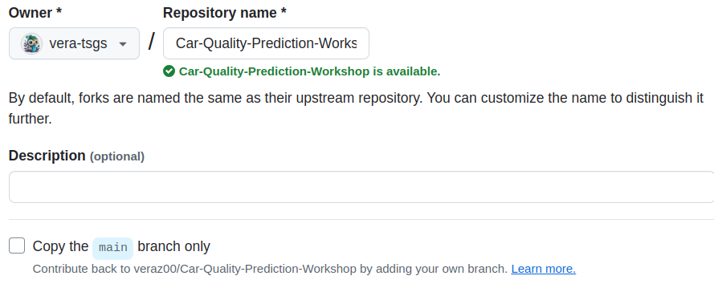
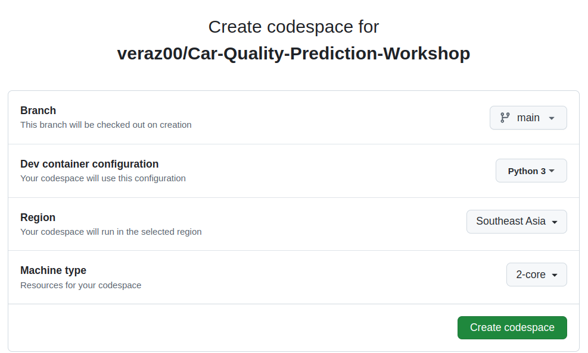
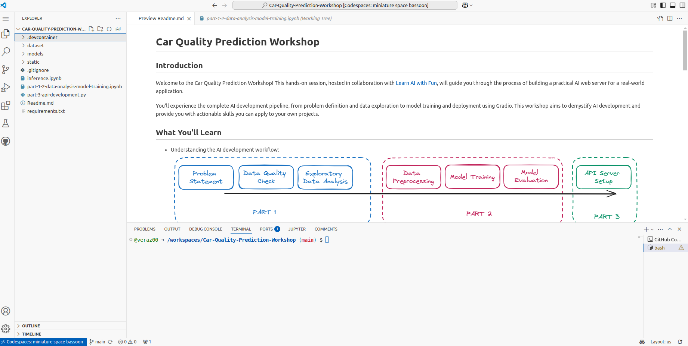
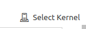
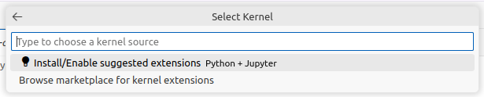
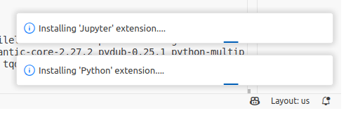

# Set up CodeSpace 
## Step 1: Fork the Workshop Repository

1. Go to the workshop repository in GitHub: <https://github.com/veraz00/Car-Quality-Prediction-Workshop>
2. Click on the **"Fork"** button to create a [fork](https://docs.github.com/en/pull-requests/collaborating-with-pull-requests/working-with-forks/fork-a-repo) of the repository.

   

3. Select the organization where you want to fork the repository to.

   

4. Remove the tick on the **"Copy the `main` branch only"** checkbox to copy all the branches.

   

5. Click on **"Create fork"** to fork the repository to your organization / personal space.

## Step 2: Start a CodeSpace
> **WARNING**: Please follow through the instructions step by step very **carefully** and not press buttons that are not mentioned inside this doc.

1. In your forked repository page, click on **"Code"**, click on the 3 dots (**"..."**) button and select **"New with Options"**.

   

2. You will see a form that lets you create your [Codespace](https://docs.github.com/en/codespaces).

   

3. Click on **"Create codespace"**.

6. Your Codespace will take a few minutes to be setup. It will open a new browser tab.

   

7. Your Codespace is ready to be used.

   

## Step 3: Install Kernel Extensions
1. Select [part-1-2-data-analysis-model-training.ipynb](./part-1-2-data-analysis-model-training.ipynb)
2. Click on **"Select Kernel"** on right upper corner 

   
3. Choose **"Install/Enable suggested extensions"**

   

4. A notification would pop up in right-bottom corner. And wait until it will vanish by its own

   

5. After that, you can successfully run this notebook