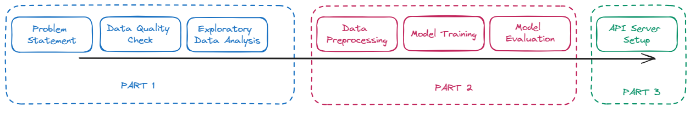

# Car Quality Prediction Workshop

## Introduction

Welcome to the Car Quality Prediction Workshop! This hands-on session, hosted in collaboration with [Learn AI with Fun](./static/post.jpeg), will guide you through the process of building a practical AI web server for a real-world application.

You'll experience the complete AI development pipeline, from problem definition and data exploration to model training and deployment using Gradio. This workshop aims to demystify AI development and provide you with actionable skills you can apply to your own projects.

## What You'll Learn

* Understanding the AI development workflow:
    
* Problem definition and refinement.
* Exploratory Data Analysis (EDA) and data quality checks.
* Model training and evaluation.
* Building and deploying a Gradio-based web API.

## Project: Predicting Car Prices for Geely Auto

**Problem Statement:**

Geely Auto, a Chinese automobile company, plans to enter the US market and needs to understand the factors influencing car prices in this region. They've tasked us with:

* Identifying the key variables that significantly predict car prices.
* Quantifying how well these variables describe the price of a car.

**Our Solution:**

We will analyze a car dataset to uncover the relationships between various features and car prices. Additionally, we'll develop a user-friendly web application to predict car prices based on user input.

## Workshop Outline

1.  [**Part 1: Data Analysis**](./part-1-2-data-analysis-model-training.ipynb)
    * Problem Refinement
    * Data Quality Assessment
    * Exploratory Data Analysis (EDA)

2.  [**Part 2: Model Development**](./part-1-2-data-analysis-model-training.ipynb)
    * Model Training
    * Model Evaluation

3.  [**Part 3: Gradio API Server Setup**](./part-3-api-development.py)

## Prerequisites (for Attendees)

* Basic programming concepts.
* Familiarity with Python.
* Basic understanding of Git and GitHub ([GitHub](https://github.com/) is required).
* A strong interest in Data Analysis, Machine Learning model building, and API concepts.

## Refer 
1. [Kaggle: Car Price Data](https://www.kaggle.com/datasets/imgowthamg/car-price)
2. [Gradio: Official Tutorials](https://www.gradio.app/guides/quickstart)

1. Check the data 
